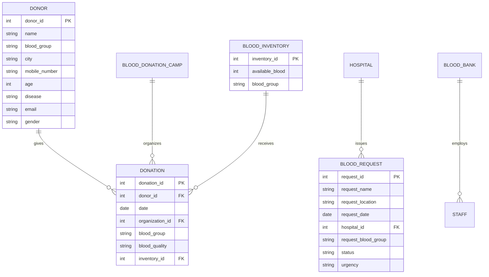

# 🏛️ HemaCare OS — System Architecture & Technical Specifications

## 1. System Overview
**HemaCare OS** is a high-reliability, fault-tolerant Enterprise Blood Bank Management System. It features:
- **Backend**: Node.js Express REST API Gateway with connection pooling (`pg.Pool`), parameterized queries, transactions, and role-based access control.
- **Database**: PostgreSQL Relational Database with ACID compliance, relational integrity (Foreign Keys, Cascades, Check Constraints), and index optimization.
- **Frontend**: Responsive Single Page Application (SPA) designed with a clinical design system, zero-dependency SVG vector charting, and two-way PostgreSQL synchronization with offline LocalStorage fallback.

---

## 2. Directory Layout & Organization

```
DBMS/
├── .env                  # Local PostgreSQL credentials (git-ignored)
├── .env.example          # Environment variable template
├── .gitignore            # Professional ignore patterns
├── package.json          # Node.js dependencies & scripts (Express, pg, cors, dotenv)
├── server.js             # Enterprise Node.js Express REST Server (Port 5000)
├── app.js                # Node.js application entry point
├── db.js                 # PostgreSQL Pool Manager & auto-migration engine (Node.js pg)
├── index.html            # Semantic HTML5 Application Interface
│
├── database/             # Relational Database Engineering
│   ├── schema.sql        # PostgreSQL DDL table definitions & constraints
│   ├── seeds.sql         # Production-like mock seed data
│   ├── queries.sql       # Complex analytical & operational SQL queries
│   ├── migrate.js        # Database migration runner in Node.js
│   ├── reset_and_seed.js # Rich seed population script in Node.js
│   ├── test_sync.js      # Bidirectional sync test runner in Node.js
│   └── test_all_endpoints.js # Automated REST API test suite in Node.js
│
├── docs/                 # System Documentation & Reports
│   ├── ARCHITECTURE.md   # System architecture & data flow
│   └── API_REFERENCE.md  # REST API specification & schemas
│
├── css/                  # Presentation Layer
│   └── styles.css        # Clinical Design System & CSS custom properties
│
└── js/                   # Client-Side Application Modules
    ├── api.js            # REST Client (timeout, exponential retry, health check)
    ├── store.js          # In-memory store & LocalStorage sync
    ├── charts.js         # Pure SVG vector charting engine (zero dependencies)
    ├── toast.js          # Stacked toast notification engine
    └── app.js            # Main UI controller & two-way PostgreSQL sync
```

---

## 3. Entity-Relationship Model (Relational Schema)



---

## 4. Resilience & Fallback Protocol
1. **Live Mode**: When PostgreSQL is running, all read/write operations execute against database tables with ACID compliance.
2. **Offline Mode**: If the database is unreachable, the client transitions seamlessly to a cached in-memory/LocalStorage state with zero disruption.
3. **Automatic Reconnection**: The frontend polls `/api/health` and automatically reconnects when the database comes back online.
